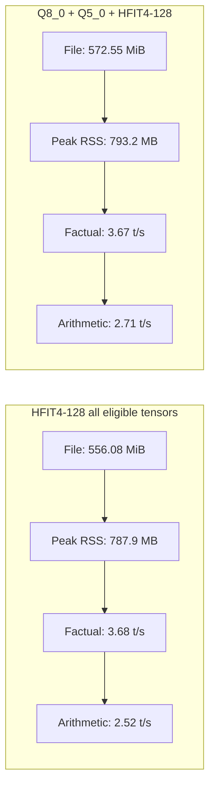

# llama.cpp


[](https://opensource.org/licenses/MIT)
[](https://github.com/ggml-org/llama.cpp/releases)
[](https://github.com/ggml-org/llama.cpp/actions/workflows/server.yml)
[](https://github.com/ggml-org/llama.cpp/actions/workflows/docker.yml)
[](https://github.com/ggml-org/llama.cpp/actions/workflows/winget.yml)

[Manifesto](https://github.com/ggml-org/llama.cpp/discussions/205) / [ggml](https://github.com/ggml-org/ggml) / [ops](https://github.com/ggml-org/llama.cpp/blob/master/docs/ops.md)

LLM inference in C/C++

## Experimental SWQ quantization notes

This fork contains an experimental `Q_SWQ_4` block-wise codebook quantizer for
GGUF tensors. It is research/prototype code, not an upstream-ready production
format yet.

SWQ stores weights as shared codebook values plus compact 4-bit indices. The
current prototype uses 128-weight blocks:

```text
128 weights represented by:
  16 FP16 codebook values
  128 packed 4-bit indices
```

This gives a raw SWQ block cost of 96 bytes per 128 weights, or about 6 bits per
weight. CPU inference support is implemented first. GPU support is not
implemented.

Test model used for the current measurements:

```text
Qwen2.5-0.5B-Instruct FP16 GGUF
CPU-only run on macOS arm64
Prompt: "The capital of India is"
16 generated tokens, 4 threads
```

Current benchmark summary:

| Model | File size | Peak RAM | Generation speed |
|---|---:|---:|---:|
| FP16 original | 1,266,425,696 bytes | 1,437,073,408 bytes | 16.9 t/s |
| Q8_0 | 675,710,816 bytes | 1,265,451,008 bytes | 16.4 t/s |
| Full SWQ128 | 521,347,936 bytes | 726,646,784 bytes | 2.8 t/s |
| Q8_0 + SWQ128 K/V | 673,990,496 bytes | 1,208,811,520 bytes | 14.9 t/s |
| Q8_0 + SWQ128 all attention | 661,948,256 bytes | 1,184,022,528 bytes | 8.0 t/s |

The usable model on this system is `Q8_0 + SWQ128 K/V`. It keeps generation
above the 10 tokens/sec target while still saving memory:

```text
RAM saved vs FP16:
  228,261,888 bytes
  217.69 MiB
  15.88% saved
  1.19x RAM ratio

RAM saved vs Q8_0:
  56,639,488 bytes
  54.02 MiB
  4.48% saved
  1.05x RAM ratio
```

Full SWQ128 saves much more RAM, about 677.52 MiB vs FP16, but it is too slow
with the current scalar CPU codebook lookup kernel. The practical conclusion is:

```text
Full SWQ128 proves compression works, but is not fast enough yet.
Q8_0 + selective SWQ128 on K/V tensors is the current usable configuration.
```

A second experimental equation-based type, `Q_SWQ_FIT_2`, was also tested. It
compresses more aggressively, using a cubic equation plus 2-bit residuals at
about 3 bpw. Full `Q_SWQ_FIT_2` produced a 336,112,480 byte model and 545,701,888
byte peak RAM, but generation dropped to 1.2 t/s and the output was incoherent.
Layer-by-layer reconstruction checks showed roughly 0.35 relative RMSE across
most transformer blocks, with worst tensors above 0.42. This format is therefore
not usable for full-model quantization yet.

`Q_SWQ_FIT_3` is now implemented as the next equation-based experiment. It uses
a cubic equation plus 3-bit residuals at 4.5 bpw. On the small Qwen test model,
full `Q_SWQ_FIT_3` saved 66.46% of SWQ tensor bytes versus FP16 tensors, reduced
mean tensor relative RMSE from 0.334946 (`FIT_2` 72x4) to 0.177571, and produced
coherent output on a 16-token smoke test. Generation was still slow at 2.7 t/s,
so this is a quality improvement, not yet a speed win.

Longer deterministic chat tests were run one process at a time with 4 CPU
threads, `--temp 0`, and a 64-token generation limit. The results were mixed:

| Test | FIT_3 result | FIT_3 speed | Q8_0 control |
|---|---|---:|---|
| Explain blue sky and red sunset | Coherent and correctly mentioned atmospheric scattering, but did not explain the red sunset | 2.4 t/s | Incomplete and scientifically weak; 59.0 t/s |
| Apple arithmetic | Incorrectly treated the 8 apples sold as the number remaining; the correct final answer is 26 | 1.2 t/s | Not run in the corrected one-process test |
| Exactly three backup steps | Coherent and followed the requested three-step format | 1.1 t/s | Not run in the corrected one-process test |

These tests show that full `Q_SWQ_FIT_3` retains basic language generation and
instruction following, but reasoning accuracy is not reliable. Its current
scalar CPU path is also about 25x slower than the measured Q8_0 control on the
same science prompt. A single coherent smoke response is therefore not enough
to claim acceptable model quality; perplexity and a larger task evaluation are
still required.

`Q_SWQ_HFIT_3_128` is the row-compatible hierarchical FIT experiment. It was
added after the 256-weight hierarchical idea compressed well offline but did not
fit most Qwen rows cleanly. The physical block is 128 weights:

```text
128 weights represented by:
  two 64-weight cubic predictors
  one FP16 coefficient scale
  eight INT8 equation coefficients
  eight FP16 residual values
  two exact FP16 anchors
  128 packed 3-bit residual indices
```

This gives a raw block cost of 80 bytes per 128 weights, or about 5 bits per
weight. On the Qwen test model, `Q_SWQ_HFIT_3_128` converted and loaded
successfully, generated the correct smoke answer, and saved real RAM, but it was
still too slow:

| Model | File size | Peak RAM | Generation speed | Smoke output |
|---|---:|---:|---:|---|
| Q8_0 | 644 MB | 1,184,448,512 bytes | 17.31 t/s | `New Delhi` |
| Q_SWQ_HFIT_3_128 | 438 MB | 641,204,224 bytes | 0.85 t/s | `The capital of India is New Delhi.` |

`Q_SWQ_HFIT_3_128` conversion summary:

```text
SWQ original tensor bytes: 1,260,477,952
SWQ tensor bytes:           453,655,040
SWQ compression ratio:             2.78x
SWQ percentage saved:             64.01%
Quant size:                    432.64 MiB
Quant BPW:                       5.76
```

The exact anchors were first checked inside every dot-product weight loop. That
was changed to a post-loop correction:

```text
dot += (exact_anchor - predicted_anchor) * activation_at_anchor
```

This removed two per-weight branch checks and reduced retired instructions by
about 6%, but generation speed stayed effectively unchanged. The dominant cost
is still reconstructing every weight through cubic math, residual lookup, and
activation multiply.

`Q_SWQ_HFIT_4_128` is the 4-bit residual-index experiment. It keeps the same
two-equation 128-weight block shape, but uses 16 residual values and 4-bit
indices instead of 8 residual values and packed 3-bit indices. An ARM NEON
accumulation path was added for `Q_SWQ_HFIT_4_128 x Q8_0`; polynomial
reconstruction is still scalar.

```text
128 weights represented by:
  two 64-weight cubic predictors
  one FP16 coefficient scale
  eight INT8 equation coefficients
  sixteen FP16 residual values
  two exact FP16 anchors
  128 packed 4-bit residual indices
```

This gives a raw block cost of 112 bytes per 128 weights, or about 7 bits per
weight. It improved speed versus HFIT3-128, but reduced compression:

| Model | File size | Peak RAM | Generation speed | Smoke output |
|---|---:|---:|---:|---|
| Q8_0 | 644 MB | 1,184,448,512 bytes | 17.31 t/s | `New Delhi` |
| Q_SWQ_HFIT_3_128 | 438 MB | 641,204,224 bytes | 0.85 t/s | `The capital of India is New Delhi.` |
| Q_SWQ_HFIT_4_128 | 556 MB | 775,307,264 bytes | 1.08 t/s | `New Delhi` |

`Q_SWQ_HFIT_4_128` conversion summary:

```text
SWQ original tensor bytes: 1,260,477,952
SWQ tensor bytes:           577,145,344
SWQ compression ratio:             2.18x
SWQ percentage saved:             54.21%
Quant size:                    550.41 MiB
Quant BPW:                       7.33
```

`Q_SWQ_PLIN3_128`, `Q_SWQ_PLIN4_128`, and `Q_SWQ_PLIN3Q_128` are the next
piecewise-linear experiments. They keep the low-RAM design, but replace cubic
weight reconstruction with four 32-weight line segments per 128-weight block.

The key runtime idea is:

```text
w_i = start + slope*i + residual

dot(x, w) =
  start * sum(x)
  + slope * sum(i*x)
  + sum(x*residual)
```

That means the equation part is handled with segment sums instead of rebuilding
every predicted weight. Only the residual codebook lookup remains per weight.

The new formats are:

| Format | Structure | Raw bytes / 128 weights | Raw bpw | Goal |
|---|---|---:|---:|---|
| Q_SWQ_PLIN3_128 | FP16 line params, 8 FP16 residuals, 3-bit indices | 80 | 5.0 | same size as HFIT3-128, cheaper math |
| Q_SWQ_PLIN4_128 | FP16 line params, 16 FP16 residuals, 4-bit indices | 112 | 7.0 | same size as HFIT4-128, better residual accuracy |
| Q_SWQ_PLIN3Q_128 | INT8 line params, one FP16 scale, 8 FP16 residuals, 3-bit indices | 74 | 4.625 | smaller than HFIT3-128, possible accuracy loss |

These PLIN formats are implemented as experimental conversion, loading, memory
reporting, dequantization, and CPU dot-product paths.

Initial Qwen2.5 0.5B tests used:

```text
./build/bin/llama-quantize --swq-stats --swq-fit-epochs 6 --swq-fit-residual-epochs 2 ...
/usr/bin/time -l ./build/bin/llama-completion -p "The capital of India is" -n 16 -t 4 --temp 0 --no-display-prompt -no-cnv
```

| Model | File size | Peak RAM | Eval speed | Smoke output quality |
|---|---:|---:|---:|---|
| Q8_0 | 644.41 MiB | 1,178,222,592 bytes | 26.75 t/s | coherent |
| Q_SWQ_HFIT_3_128 | 438.31 MiB | 649,510,912 bytes | 0.91 t/s | weak |
| Q_SWQ_HFIT_4_128 | 556.08 MiB | 792,035,328 bytes | 1.68 t/s | coherent |
| Q_SWQ_PLIN3_128 | 438.31 MiB | 656,097,280 bytes | 1.16 t/s | weak but mentions New Delhi |
| Q_SWQ_PLIN4_128 | 556.08 MiB | 783,269,888 bytes | 1.09 t/s | coherent but question-like |
| Q_SWQ_PLIN3Q_128 | 416.23 MiB | 631,259,136 bytes | 1.19 t/s | repetitive but mentions Delhi |

`Q_SWQ_PLIN3Q_128` is the smallest tested full-model runtime format so far:

```text
File saved vs Q8_0: 228.18 MiB
Peak RAM saved vs Q8_0: 521.62 MiB
Peak RAM saved vs Q8_0: 46.42%
```

The PLIN result is useful but not fast enough. The dot-product identity reduced
the equation cost, but the scalar residual lookup and nonstandard kernel still
leave full-model speed far below the 10 t/s target. `Q_SWQ_HFIT_4_128` remains
the fastest full-model SWQ-family result in this set, while selective Q8_0 plus
SWQ on fewer tensors remains the only tested path above 10 t/s.

The current research status is:

```text
Q_SWQ_4: compresses, loads, and runs, but full-model speed is too slow.
Q_SWQ_FIT_2: very small, but too inaccurate.
Q_SWQ_FIT_3: better quality, still too slow.
Q_SWQ_HFIT_3_128: best RAM-saving runtime HFIT result, still too slow.
Q_SWQ_HFIT_4_128: faster than HFIT3-128, but larger and still too slow.
Q_SWQ_PLIN3_128: same size as HFIT3-128, slightly faster than HFIT3-128, still too slow.
Q_SWQ_PLIN4_128: same size as HFIT4-128, slower than HFIT4-128.
Q_SWQ_PLIN3Q_128: smallest full-model runtime result so far, still too slow.
Q8_0 + selective SWQ128 K/V: current usable local tradeoff above 10 t/s.
```

The practical next direction is selective/hybrid quantization or a much more
specialized kernel. Full equation-derived weights are not fast enough yet on
this CPU path.

An earlier attempt appeared to produce truncated responses because several
`llama-cli` processes remained active after the command-output wrapper returned.
Those results are not used above. The corrected measurements poll one process
until it exits before starting the next model.

### Configurable HFIT4 mixed-format follow-up

`llama-quantize` can assign different quantization types to tensors through a
regular-expression configuration file. A follow-up compared full
`Q_SWQ_HFIT_4_128` against this three-tier profile:

```text
token embedding and output: Q8_0
attention weights:           Q5_0
FFN gate/up/down weights:     Q_SWQ_HFIT_4_128
```

The profile file contained:

```text
\.attn_(q|k|v|output)\.weight=q5_0
\.ffn_(gate|up|down)\.weight=q_swq_hfit_4_128
```

The Q5_0 block size is 32, so it is compatible with the Qwen row widths that
prevented a standard 256-weight HFIT block. The model was converted with Q8_0
as the default and explicit Q8_0 embedding and output types:

```sh
./build/bin/llama-quantize --swq-stats \
  --swq-fit-epochs 6 \
  --swq-fit-residual-epochs 2 \
  --tensor-type-file models/swq/tensor-types-hfit4-smart.txt \
  --output-tensor-type q8_0 \
  --token-embedding-type q8_0 \
  model-f16.gguf \
  model-q8-q5-hfit4-smart.gguf \
  Q8_0
```

Both models used four threads, temperature 0, and the same deterministic
prompts. File and RAM measurements came from completed runs. The factual speed
pair used the same 16-token smoke shape; the reasoning pair used the same
64-token arithmetic prompt.

| Metric | HFIT4-128 on all eligible tensors | Q8_0 + Q5_0 + HFIT4-128 |
|---|---:|---:|
| File size | 556.08 MiB | 572.55 MiB |
| Peak RSS | 787,857,408 bytes | 793,247,744 bytes |
| Factual generation | 3.68 t/s | 3.67 t/s |
| Arithmetic generation | 2.52 t/s | 2.71 t/s |
| Factual output | correct and direct | correct option, but changed to multiple choice |
| Longer output | repetitive | unrelated or unstable |



The mixed profile improved arithmetic generation by about 7.5%, but did not
improve factual generation, increased file size and peak RSS, and made the
factual response less direct. A 96-token pair was interrupted before timing
completed. A replacement long run encountered a severe host slowdown, so no
long-form speed claim is made. The partial text still showed that neither model
was reliable for longer generation. Full HFIT4-128 therefore remains the better
result in this follow-up; future mixed profiles need tensor sensitivity evidence
rather than only tensor-category rules.

Example mixed conversion command:

```sh
./build/bin/llama-quantize --swq-stats \
  --tensor-type attn_k=q_swq_4 \
  --tensor-type attn_v=q_swq_4 \
  model-f16.gguf \
  model-q8-swq-kv-128.gguf \
  Q8_0
```

FIT epoch experiments can be configured without rebuilding:

```sh
./build/bin/llama-quantize --swq-stats \
  --swq-fit-epochs 24 \
  --swq-fit-residual-epochs 4 \
  --swq-fit-progress \
  model-f16.gguf \
  model-q-swq-fit-2.gguf \
  Q_SWQ_FIT_2
```

Example `Q_SWQ_FIT_3` conversion command:

```sh
./build/bin/llama-quantize --swq-stats \
  --swq-fit-epochs 72 \
  --swq-fit-residual-epochs 4 \
  model-f16.gguf \
  model-q-swq-fit-3.gguf \
  Q_SWQ_FIT_3
```

Example `Q_SWQ_HFIT_3_128` conversion command:

```sh
./build/bin/llama-quantize --swq-stats \
  --swq-fit-epochs 6 \
  --swq-fit-residual-epochs 2 \
  model-f16.gguf \
  model-q-swq-hfit-3-128.gguf \
  Q_SWQ_HFIT_3_128
```

Example `Q_SWQ_HFIT_4_128` conversion command:

```sh
./build/bin/llama-quantize --swq-stats \
  --swq-fit-epochs 6 \
  --swq-fit-residual-epochs 2 \
  model-f16.gguf \
  model-q-swq-hfit-4-128.gguf \
  Q_SWQ_HFIT_4_128
```

`--swq-fit-progress` prints per-tensor epoch stats such as RMSE and relative
RMSE while converting.

Example inference command:

```sh
./build/bin/llama-cli \
  -m model-q8-swq-kv-128.gguf \
  -ngl 0 \
  --swq-stats \
  --single-turn \
  -p "The capital of India is" \
  -n 64 \
  -t 4 \
  --temp 0.7
```

Implementation notes and full findings are in:

- `docs/development/SWQ.md`
- `docs/development/SWQ-FINDINGS.md`
- `docs/development/SWQ-RESEARCH-PAPER.md`

## Recent API changes

- [Changelog for `libllama` API](https://github.com/ggml-org/llama.cpp/issues/9289)
- [Changelog for `llama-server` REST API](https://github.com/ggml-org/llama.cpp/issues/9291)

## Hot topics

- **Hugging Face cache migration: models downloaded with `-hf` are now stored in the standard Hugging Face cache directory, enabling sharing with other HF tools.**
- **[guide : using the new WebUI of llama.cpp](https://github.com/ggml-org/llama.cpp/discussions/16938)**
- [guide : running gpt-oss with llama.cpp](https://github.com/ggml-org/llama.cpp/discussions/15396)
- [[FEEDBACK] Better packaging for llama.cpp to support downstream consumers 🤗](https://github.com/ggml-org/llama.cpp/discussions/15313)
- Support for the `gpt-oss` model with native MXFP4 format has been added | [PR](https://github.com/ggml-org/llama.cpp/pull/15091) | [Collaboration with NVIDIA](https://blogs.nvidia.com/blog/rtx-ai-garage-openai-oss) | [Comment](https://github.com/ggml-org/llama.cpp/discussions/15095)
- Multimodal support arrived in `llama-server`: [#12898](https://github.com/ggml-org/llama.cpp/pull/12898) | [documentation](./docs/multimodal.md)
- VS Code extension for FIM completions: https://github.com/ggml-org/llama.vscode
- Vim/Neovim plugin for FIM completions: https://github.com/ggml-org/llama.vim
- Hugging Face Inference Endpoints now support GGUF out of the box! https://github.com/ggml-org/llama.cpp/discussions/9669
- Hugging Face GGUF editor: [discussion](https://github.com/ggml-org/llama.cpp/discussions/9268) | [tool](https://huggingface.co/spaces/CISCai/gguf-editor)
- WebGPU support is now available in the browser, see a blog/demo introducing it [here](https://reeselevine.github.io/llamas-on-the-web/).

----

## Quick start

Getting started with llama.cpp is straightforward. Here are several ways to install it on your machine:

- Install `llama.cpp` using [brew, nix, winget, or conda-forge](docs/install.md)
- Run with Docker - see our [Docker documentation](docs/docker.md)
- Download pre-built binaries from the [releases page](https://github.com/ggml-org/llama.cpp/releases)
- Build from source by cloning this repository - check out [our build guide](docs/build.md)

Once installed, you'll need a model to work with. Head to the [Obtaining and quantizing models](#obtaining-and-quantizing-models) section to learn more.

Example command:

```sh
# Use a local model file
llama-cli -m my_model.gguf

# Or download and run a model directly from Hugging Face
llama-cli -hf ggml-org/gemma-3-1b-it-GGUF

# Launch OpenAI-compatible API server
llama-server -hf ggml-org/gemma-3-1b-it-GGUF
```

## Description

The main goal of `llama.cpp` is to enable LLM inference with minimal setup and state-of-the-art performance on a wide
range of hardware - locally and in the cloud.

- Plain C/C++ implementation without any dependencies
- Apple silicon is a first-class citizen - optimized via ARM NEON, Accelerate and Metal frameworks
- AVX, AVX2, AVX512 and AMX support for x86 architectures
- RVV, ZVFH, ZFH, ZICBOP and ZIHINTPAUSE support for RISC-V architectures
- 1.5-bit, 2-bit, 3-bit, 4-bit, 5-bit, 6-bit, and 8-bit integer quantization for faster inference and reduced memory use
- Custom CUDA kernels for running LLMs on NVIDIA GPUs (support for AMD GPUs via HIP and Moore Threads GPUs via MUSA)
- Vulkan and SYCL backend support
- CPU+GPU hybrid inference to partially accelerate models larger than the total VRAM capacity

The `llama.cpp` project is the main playground for developing new features for the [ggml](https://github.com/ggml-org/ggml) library.

<details>
<summary>Models</summary>

Typically finetunes of the base models below are supported as well.

Instructions for adding support for new models: [HOWTO-add-model.md](docs/development/HOWTO-add-model.md)

#### Text-only

- [X] LLaMA 🦙
- [x] LLaMA 2 🦙🦙
- [x] LLaMA 3 🦙🦙🦙
- [X] [Mistral 7B](https://huggingface.co/mistralai/Mistral-7B-v0.1)
- [x] [Mixtral MoE](https://huggingface.co/models?search=mistral-ai/Mixtral)
- [x] [DBRX](https://huggingface.co/databricks/dbrx-instruct)
- [x] [Jamba](https://huggingface.co/ai21labs)
- [X] [Falcon](https://huggingface.co/models?search=tiiuae/falcon)
- [X] [Chinese LLaMA / Alpaca](https://github.com/ymcui/Chinese-LLaMA-Alpaca) and [Chinese LLaMA-2 / Alpaca-2](https://github.com/ymcui/Chinese-LLaMA-Alpaca-2)
- [X] [Vigogne (French)](https://github.com/bofenghuang/vigogne)
- [X] [BERT](https://github.com/ggml-org/llama.cpp/pull/5423)
- [X] [Koala](https://bair.berkeley.edu/blog/2023/04/03/koala/)
- [X] [Baichuan 1 & 2](https://huggingface.co/models?search=baichuan-inc/Baichuan) + [derivations](https://huggingface.co/hiyouga/baichuan-7b-sft)
- [X] [Aquila 1 & 2](https://huggingface.co/models?search=BAAI/Aquila)
- [X] [Starcoder models](https://github.com/ggml-org/llama.cpp/pull/3187)
- [X] [Refact](https://huggingface.co/smallcloudai/Refact-1_6B-fim)
- [X] [MPT](https://github.com/ggml-org/llama.cpp/pull/3417)
- [X] [Bloom](https://github.com/ggml-org/llama.cpp/pull/3553)
- [x] [Yi models](https://huggingface.co/models?search=01-ai/Yi)
- [X] [StableLM models](https://huggingface.co/stabilityai)
- [x] [Deepseek models](https://huggingface.co/models?search=deepseek-ai/deepseek)
- [x] [Qwen models](https://huggingface.co/models?search=Qwen/Qwen)
- [x] [PLaMo-13B](https://github.com/ggml-org/llama.cpp/pull/3557)
- [x] [Phi models](https://huggingface.co/models?search=microsoft/phi)
- [x] [PhiMoE](https://github.com/ggml-org/llama.cpp/pull/11003)
- [x] [GPT-2](https://huggingface.co/gpt2)
- [x] [Orion 14B](https://github.com/ggml-org/llama.cpp/pull/5118)
- [x] [InternLM2](https://huggingface.co/models?search=internlm2)
- [x] [CodeShell](https://github.com/WisdomShell/codeshell)
- [x] [Gemma](https://ai.google.dev/gemma)
- [x] [Mamba](https://github.com/state-spaces/mamba)
- [x] [Grok-1](https://huggingface.co/keyfan/grok-1-hf)
- [x] [Xverse](https://huggingface.co/models?search=xverse)
- [x] [Command-R models](https://huggingface.co/models?search=CohereForAI/c4ai-command-r)
- [x] [SEA-LION](https://huggingface.co/models?search=sea-lion)
- [x] [GritLM-7B](https://huggingface.co/GritLM/GritLM-7B) + [GritLM-8x7B](https://huggingface.co/GritLM/GritLM-8x7B)
- [x] [OLMo](https://allenai.org/olmo)
- [x] [OLMo 2](https://allenai.org/olmo)
- [x] [OLMoE](https://huggingface.co/allenai/OLMoE-1B-7B-0924)
- [x] [Granite models](https://huggingface.co/collections/ibm-granite/granite-code-models-6624c5cec322e4c148c8b330)
- [x] [GPT-NeoX](https://github.com/EleutherAI/gpt-neox) + [Pythia](https://github.com/EleutherAI/pythia)
- [x] [Snowflake-Arctic MoE](https://huggingface.co/collections/Snowflake/arctic-66290090abe542894a5ac520)
- [x] [Smaug](https://huggingface.co/models?search=Smaug)
- [x] [Poro 34B](https://huggingface.co/LumiOpen/Poro-34B)
- [x] [Bitnet b1.58 models](https://huggingface.co/1bitLLM)
- [x] [Flan T5](https://huggingface.co/models?search=flan-t5)
- [x] [Open Elm models](https://huggingface.co/collections/apple/openelm-instruct-models-6619ad295d7ae9f868b759ca)
- [x] [ChatGLM3-6b](https://huggingface.co/THUDM/chatglm3-6b) + [ChatGLM4-9b](https://huggingface.co/THUDM/glm-4-9b) + [GLMEdge-1.5b](https://huggingface.co/THUDM/glm-edge-1.5b-chat) + [GLMEdge-4b](https://huggingface.co/THUDM/glm-edge-4b-chat)
- [x] [GLM-4-0414](https://huggingface.co/collections/THUDM/glm-4-0414-67f3cbcb34dd9d252707cb2e)
- [x] [SmolLM](https://huggingface.co/collections/HuggingFaceTB/smollm-6695016cad7167254ce15966)
- [x] [EXAONE-3.0-7.8B-Instruct](https://huggingface.co/LGAI-EXAONE/EXAONE-3.0-7.8B-Instruct)
- [x] [FalconMamba Models](https://huggingface.co/collections/tiiuae/falconmamba-7b-66b9a580324dd1598b0f6d4a)
- [x] [Jais](https://huggingface.co/inceptionai/jais-13b-chat)
- [x] [Bielik-11B-v2.3](https://huggingface.co/collections/speakleash/bielik-11b-v23-66ee813238d9b526a072408a)
- [x] [RWKV-7](https://huggingface.co/collections/shoumenchougou/rwkv7-gxx-gguf)
- [x] [RWKV-6](https://github.com/BlinkDL/RWKV-LM)
- [x] [QRWKV-6](https://huggingface.co/recursal/QRWKV6-32B-Instruct-Preview-v0.1)
- [x] [GigaChat-20B-A3B](https://huggingface.co/ai-sage/GigaChat-20B-A3B-instruct)
- [X] [Trillion-7B-preview](https://huggingface.co/trillionlabs/Trillion-7B-preview)
- [x] [Ling models](https://huggingface.co/collections/inclusionAI/ling-67c51c85b34a7ea0aba94c32)
- [x] [Liquid LFM2 models](https://huggingface.co/collections/LiquidAI/lfm2)
- [x] [Liquid LFM2.5 models](https://huggingface.co/collections/LiquidAI/lfm25)
- [x] [Liquid Nanos](https://huggingface.co/collections/LiquidAI/liquid-nanos)
- [x] [Hunyuan models](https://huggingface.co/collections/tencent/hunyuan-dense-model-6890632cda26b19119c9c5e7)
- [x] [BailingMoeV2 (Ring/Ling 2.0) models](https://huggingface.co/collections/inclusionAI/ling-v2-68bf1dd2fc34c306c1fa6f86)
- [x] [Mellum models](https://huggingface.co/JetBrains/models?search=mellum)

#### Multimodal

- [x] [LLaVA 1.5 models](https://huggingface.co/collections/liuhaotian/llava-15-653aac15d994e992e2677a7e), [LLaVA 1.6 models](https://huggingface.co/collections/liuhaotian/llava-16-65b9e40155f60fd046a5ccf2)
- [x] [BakLLaVA](https://huggingface.co/models?search=SkunkworksAI/Bakllava)
- [x] [Obsidian](https://huggingface.co/NousResearch/Obsidian-3B-V0.5)
- [x] [ShareGPT4V](https://huggingface.co/models?search=Lin-Chen/ShareGPT4V)
- [x] [MobileVLM 1.7B/3B models](https://huggingface.co/models?search=mobileVLM)
- [x] [Yi-VL](https://huggingface.co/models?search=Yi-VL)
- [x] [Mini CPM](https://huggingface.co/models?search=MiniCPM)
- [x] [Moondream](https://huggingface.co/vikhyatk/moondream2)
- [x] [Bunny](https://github.com/BAAI-DCAI/Bunny)
- [x] [GLM-EDGE](https://huggingface.co/models?search=glm-edge)
- [x] [Qwen2-VL](https://huggingface.co/collections/Qwen/qwen2-vl-66cee7455501d7126940800d)
- [x] [LFM2-VL](https://huggingface.co/collections/LiquidAI/lfm2-vl-68963bbc84a610f7638d5ffa)

</details>

<details>
<summary>Bindings</summary>

- Python: [ddh0/easy-llama](https://github.com/ddh0/easy-llama)
- Python: [abetlen/llama-cpp-python](https://github.com/abetlen/llama-cpp-python)
- Go: [go-skynet/go-llama.cpp](https://github.com/go-skynet/go-llama.cpp)
- Node.js: [withcatai/node-llama-cpp](https://github.com/withcatai/node-llama-cpp)
- JS/TS (llama.cpp server client): [lgrammel/modelfusion](https://modelfusion.dev/integration/model-provider/llamacpp)
- JS/TS (Programmable Prompt Engine CLI): [offline-ai/cli](https://github.com/offline-ai/cli)
- JavaScript/Wasm (works in browser): [tangledgroup/llama-cpp-wasm](https://github.com/tangledgroup/llama-cpp-wasm)
- Typescript/Wasm (nicer API, available on npm): [ngxson/wllama](https://github.com/ngxson/wllama)
- Ruby: [yoshoku/llama_cpp.rb](https://github.com/yoshoku/llama_cpp.rb)
- Ruby: [docusealco/rllama](https://github.com/docusealco/rllama)
- Rust (more features): [edgenai/llama_cpp-rs](https://github.com/edgenai/llama_cpp-rs)
- Rust (nicer API): [mdrokz/rust-llama.cpp](https://github.com/mdrokz/rust-llama.cpp)
- Rust (more direct bindings): [utilityai/llama-cpp-rs](https://github.com/utilityai/llama-cpp-rs)
- Rust (automated build from crates.io): [ShelbyJenkins/llm_client](https://github.com/ShelbyJenkins/llm_client)
- C#/.NET: [SciSharp/LLamaSharp](https://github.com/SciSharp/LLamaSharp)
- C#/VB.NET (more features - community license): [LM-Kit.NET](https://docs.lm-kit.com/lm-kit-net/index.html)
- Scala 3: [donderom/llm4s](https://github.com/donderom/llm4s)
- Clojure: [phronmophobic/llama.clj](https://github.com/phronmophobic/llama.clj)
- React Native: [mybigday/llama.rn](https://github.com/mybigday/llama.rn)
- Java: [kherud/java-llama.cpp](https://github.com/kherud/java-llama.cpp)
- Java: [QuasarByte/llama-cpp-jna](https://github.com/QuasarByte/llama-cpp-jna)
- Zig: [deins/llama.cpp.zig](https://github.com/Deins/llama.cpp.zig)
- Flutter/Dart: [netdur/llama_cpp_dart](https://github.com/netdur/llama_cpp_dart)
- Flutter: [xuegao-tzx/Fllama](https://github.com/xuegao-tzx/Fllama)
- PHP (API bindings and features built on top of llama.cpp): [distantmagic/resonance](https://github.com/distantmagic/resonance) [(more info)](https://github.com/ggml-org/llama.cpp/pull/6326)
- Guile Scheme: [guile_llama_cpp](https://savannah.nongnu.org/projects/guile-llama-cpp)
- Swift [srgtuszy/llama-cpp-swift](https://github.com/srgtuszy/llama-cpp-swift)
- Swift [ShenghaiWang/SwiftLlama](https://github.com/ShenghaiWang/SwiftLlama)
- Delphi [Embarcadero/llama-cpp-delphi](https://github.com/Embarcadero/llama-cpp-delphi)
- Go (no CGo needed): [hybridgroup/yzma](https://github.com/hybridgroup/yzma)
- Android: [llama.android](/examples/llama.android)

</details>

<details>
<summary>UIs</summary>

*(to have a project listed here, it should clearly state that it depends on `llama.cpp`)*

- [AI Sublime Text plugin](https://github.com/yaroslavyaroslav/OpenAI-sublime-text) (MIT)
- [BonzAI App](https://apps.apple.com/us/app/bonzai-your-local-ai-agent/id6752847988) (proprietary)
- [cztomsik/ava](https://github.com/cztomsik/ava) (MIT)
- [Dot](https://github.com/alexpinel/Dot) (GPL)
- [eva](https://github.com/ylsdamxssjxxdd/eva) (MIT)
- [iohub/collama](https://github.com/iohub/coLLaMA) (Apache-2.0)
- [janhq/jan](https://github.com/janhq/jan) (AGPL)
- [johnbean393/Sidekick](https://github.com/johnbean393/Sidekick) (MIT)
- [KanTV](https://github.com/zhouwg/kantv?tab=readme-ov-file) (Apache-2.0)
- [KodiBot](https://github.com/firatkiral/kodibot) (GPL)
- [llama.vim](https://github.com/ggml-org/llama.vim) (MIT)
- [LARS](https://github.com/abgulati/LARS) (AGPL)
- [Llama Assistant](https://github.com/vietanhdev/llama-assistant) (GPL)
- [LlamaLib](https://github.com/undreamai/LlamaLib) (Apache-2.0)
- [LLMFarm](https://github.com/guinmoon/LLMFarm?tab=readme-ov-file) (MIT)
- [LLMUnity](https://github.com/undreamai/LLMUnity) (MIT)
- [LMStudio](https://lmstudio.ai/) (proprietary)
- [LocalAI](https://github.com/mudler/LocalAI) (MIT)
- [LostRuins/koboldcpp](https://github.com/LostRuins/koboldcpp) (AGPL)
- [MindMac](https://mindmac.app) (proprietary)
- [MindWorkAI/AI-Studio](https://github.com/MindWorkAI/AI-Studio) (FSL-1.1-MIT)
- [Mobile-Artificial-Intelligence/maid](https://github.com/Mobile-Artificial-Intelligence/maid) (MIT)
- [Mozilla-Ocho/llamafile](https://github.com/Mozilla-Ocho/llamafile) (Apache-2.0)
- [nat/openplayground](https://github.com/nat/openplayground) (MIT)
- [nomic-ai/gpt4all](https://github.com/nomic-ai/gpt4all) (MIT)
- [ollama/ollama](https://github.com/ollama/ollama) (MIT)
- [oobabooga/text-generation-webui](https://github.com/oobabooga/text-generation-webui) (AGPL)
- [PocketPal AI](https://github.com/a-ghorbani/pocketpal-ai) (MIT)
- [psugihara/FreeChat](https://github.com/psugihara/FreeChat) (MIT)
- [ptsochantaris/emeltal](https://github.com/ptsochantaris/emeltal) (MIT)
- [pythops/tenere](https://github.com/pythops/tenere) (AGPL)
- [ramalama](https://github.com/containers/ramalama) (MIT)
- [semperai/amica](https://github.com/semperai/amica) (MIT)
- [withcatai/catai](https://github.com/withcatai/catai) (MIT)
- [Autopen](https://github.com/blackhole89/autopen) (GPL)

</details>

<details>
<summary>Tools</summary>

- [akx/ggify](https://github.com/akx/ggify) – download PyTorch models from Hugging Face Hub and convert them to GGML
- [akx/ollama-dl](https://github.com/akx/ollama-dl) – download models from the Ollama library to be used directly with llama.cpp
- [crashr/gppm](https://github.com/crashr/gppm) – launch llama.cpp instances utilizing NVIDIA Tesla P40 or P100 GPUs with reduced idle power consumption
- [gpustack/gguf-parser](https://github.com/gpustack/gguf-parser-go/tree/main/cmd/gguf-parser) - review/check the GGUF file and estimate the memory usage
- [Styled Lines](https://marketplace.unity.com/packages/tools/generative-ai/styled-lines-llama-cpp-model-292902) (proprietary licensed, async wrapper of inference part for game development in Unity3d with pre-built Mobile and Web platform wrappers and a model example)
- [unslothai/unsloth](https://github.com/unslothai/unsloth) – 🦥 exports/saves fine-tuned and trained models to GGUF (Apache-2.0)

</details>

<details>
<summary>Infrastructure</summary>

- [Paddler](https://github.com/intentee/paddler) - Open-source LLMOps platform for hosting and scaling AI in your own infrastructure
- [GPUStack](https://github.com/gpustack/gpustack) - Manage GPU clusters for running LLMs
- [llama_cpp_canister](https://github.com/onicai/llama_cpp_canister) - llama.cpp as a smart contract on the Internet Computer, using WebAssembly
- [llama-swap](https://github.com/mostlygeek/llama-swap) - transparent proxy that adds automatic model switching with llama-server
- [Kalavai](https://github.com/kalavai-net/kalavai-client) - Crowdsource end to end LLM deployment at any scale
- [llmaz](https://github.com/InftyAI/llmaz) - ☸️ Easy, advanced inference platform for large language models on Kubernetes.
- [LLMKube](https://github.com/defilantech/llmkube) - Kubernetes operator for llama.cpp with multi-GPU and Apple Silicon Metal
  support"
</details>

<details>
<summary>Games</summary>

- [Lucy's Labyrinth](https://github.com/MorganRO8/Lucys_Labyrinth) - A simple maze game where agents controlled by an AI model will try to trick you.

</details>


## Supported backends

| Backend | Target devices |
| --- | --- |
| [Metal](docs/build.md#metal-build) | Apple Silicon |
| [BLAS](docs/build.md#blas-build) | All |
| [BLIS](docs/backend/BLIS.md) | All |
| [SYCL](docs/backend/SYCL.md) | Intel GPU |
| [OpenVINO [In Progress]](docs/backend/OPENVINO.md) | Intel CPUs, GPUs, and NPUs |
| [MUSA](docs/build.md#musa) | Moore Threads GPU |
| [CUDA](docs/build.md#cuda) | Nvidia GPU |
| [HIP](docs/build.md#hip) | AMD GPU |
| [ZenDNN](docs/build.md#zendnn) | AMD CPU |
| [Vulkan](docs/build.md#vulkan) | GPU |
| [CANN](docs/build.md#cann) | Ascend NPU |
| [OpenCL](docs/backend/OPENCL.md) | Adreno GPU |
| [IBM zDNN](docs/backend/zDNN.md) | IBM Z & LinuxONE |
| [WebGPU](docs/build.md#webgpu) | All |
| [RPC](https://github.com/ggml-org/llama.cpp/tree/master/tools/rpc) | All |
| [Hexagon [In Progress]](docs/backend/snapdragon/README.md) | Snapdragon |
| [VirtGPU](docs/backend/VirtGPU.md) | VirtGPU APIR |

## Obtaining and quantizing models

The [Hugging Face](https://huggingface.co) platform hosts a [number of LLMs](https://huggingface.co/models?library=gguf&sort=trending) compatible with `llama.cpp`:

- [Trending](https://huggingface.co/models?library=gguf&sort=trending)
- [LLaMA](https://huggingface.co/models?sort=trending&search=llama+gguf)

You can either manually download the GGUF file or directly use any `llama.cpp`-compatible models from [Hugging Face](https://huggingface.co/) or other model hosting sites, by using this CLI argument: `-hf <user>/<model>[:quant]`. For example:

```sh
llama-cli -hf ggml-org/gemma-3-1b-it-GGUF
```

By default, the CLI would download from Hugging Face, you can switch to other options with the environment variable `MODEL_ENDPOINT`. The `MODEL_ENDPOINT` must point to a Hugging Face compatible API endpoint.

After downloading a model, use the CLI tools to run it locally - see below.

`llama.cpp` requires the model to be stored in the [GGUF](https://github.com/ggml-org/ggml/blob/master/docs/gguf.md) file format. Models in other data formats can be converted to GGUF using the `convert_*.py` Python scripts in this repo.

The Hugging Face platform provides a variety of online tools for converting, quantizing and hosting models with `llama.cpp`:

- Use the [GGUF-my-repo space](https://huggingface.co/spaces/ggml-org/gguf-my-repo) to convert to GGUF format and quantize model weights to smaller sizes
- Use the [GGUF-my-LoRA space](https://huggingface.co/spaces/ggml-org/gguf-my-lora) to convert LoRA adapters to GGUF format (more info: https://github.com/ggml-org/llama.cpp/discussions/10123)
- Use the [GGUF-editor space](https://huggingface.co/spaces/CISCai/gguf-editor) to edit GGUF meta data in the browser (more info: https://github.com/ggml-org/llama.cpp/discussions/9268)
- Use the [Inference Endpoints](https://ui.endpoints.huggingface.co/) to directly host `llama.cpp` in the cloud (more info: https://github.com/ggml-org/llama.cpp/discussions/9669)

To learn more about model quantization, [read this documentation](tools/quantize/README.md)

## [`llama-cli`](tools/cli)

#### A CLI tool for accessing and experimenting with most of `llama.cpp`'s functionality.

- <details open>
    <summary>Run in conversation mode</summary>

    Models with a built-in chat template will automatically activate conversation mode. If this doesn't occur, you can manually enable it by adding `-cnv` and specifying a suitable chat template with `--chat-template NAME`

    ```bash
    llama-cli -m model.gguf

    # > hi, who are you?
    # Hi there! I'm your helpful assistant! I'm an AI-powered chatbot designed to assist and provide information to users like you. I'm here to help answer your questions, provide guidance, and offer support on a wide range of topics. I'm a friendly and knowledgeable AI, and I'm always happy to help with anything you need. What's on your mind, and how can I assist you today?
    #
    # > what is 1+1?
    # Easy peasy! The answer to 1+1 is... 2!
    ```

    </details>

- <details>
    <summary>Run in conversation mode with custom chat template</summary>

    ```bash
    # use the "chatml" template (use -h to see the list of supported templates)
    llama-cli -m model.gguf -cnv --chat-template chatml

    # use a custom template
    llama-cli -m model.gguf -cnv --in-prefix 'User: ' --reverse-prompt 'User:'
    ```

    </details>

- <details>
    <summary>Constrain the output with a custom grammar</summary>

    ```bash
    llama-cli -m model.gguf -n 256 --grammar-file grammars/json.gbnf -p 'Request: schedule a call at 8pm; Command:'

    # {"appointmentTime": "8pm", "appointmentDetails": "schedule a a call"}
    ```

    The [grammars/](grammars/) folder contains a handful of sample grammars. To write your own, check out the [GBNF Guide](grammars/README.md).

    For authoring more complex JSON grammars, check out https://grammar.intrinsiclabs.ai/

    </details>


## [`llama-server`](tools/server)

#### A lightweight, [OpenAI API](https://github.com/openai/openai-openapi) compatible, HTTP server for serving LLMs.

- <details open>
    <summary>Start a local HTTP server with default configuration on port 8080</summary>

    ```bash
    llama-server -m model.gguf --port 8080

    # Basic web UI can be accessed via browser: http://localhost:8080
    # Chat completion endpoint: http://localhost:8080/v1/chat/completions
    ```

    </details>

- <details>
    <summary>Support multiple-users and parallel decoding</summary>

    ```bash
    # up to 4 concurrent requests, each with 4096 max context
    llama-server -m model.gguf -c 16384 -np 4
    ```

    </details>

- <details>
    <summary>Enable speculative decoding</summary>

    ```bash
    # the draft.gguf model should be a small variant of the target model.gguf
    llama-server -m model.gguf -md draft.gguf
    ```

    </details>

- <details>
    <summary>Serve an embedding model</summary>

    ```bash
    # use the /embedding endpoint
    llama-server -m model.gguf --embedding --pooling cls -ub 8192
    ```

    </details>

- <details>
    <summary>Serve a reranking model</summary>

    ```bash
    # use the /reranking endpoint
    llama-server -m model.gguf --reranking
    ```

    </details>

- <details>
    <summary>Constrain all outputs with a grammar</summary>

    ```bash
    # custom grammar
    llama-server -m model.gguf --grammar-file grammar.gbnf

    # JSON
    llama-server -m model.gguf --grammar-file grammars/json.gbnf
    ```

    </details>


## [`llama-perplexity`](tools/perplexity)

#### A tool for measuring the [perplexity](tools/perplexity/README.md) [^1] (and other quality metrics) of a model over a given text.

- <details open>
    <summary>Measure the perplexity over a text file</summary>

    ```bash
    llama-perplexity -m model.gguf -f file.txt

    # [1]15.2701,[2]5.4007,[3]5.3073,[4]6.2965,[5]5.8940,[6]5.6096,[7]5.7942,[8]4.9297, ...
    # Final estimate: PPL = 5.4007 +/- 0.67339
    ```

    </details>

- <details>
    <summary>Measure KL divergence</summary>

    ```bash
    # TODO
    ```

    </details>

[^1]: [https://huggingface.co/docs/transformers/perplexity](https://huggingface.co/docs/transformers/perplexity)

## [`llama-bench`](tools/llama-bench)

#### Benchmark the performance of the inference for various parameters.

- <details open>
    <summary>Run default benchmark</summary>

    ```bash
    llama-bench -m model.gguf

    # Output:
    # | model               |       size |     params | backend    | threads |          test |                  t/s |
    # | ------------------- | ---------: | ---------: | ---------- | ------: | ------------: | -------------------: |
    # | qwen2 1.5B Q4_0     | 885.97 MiB |     1.54 B | Metal,BLAS |      16 |         pp512 |      5765.41 ± 20.55 |
    # | qwen2 1.5B Q4_0     | 885.97 MiB |     1.54 B | Metal,BLAS |      16 |         tg128 |        197.71 ± 0.81 |
    #
    # build: 3e0ba0e60 (4229)
    ```

    </details>

## [`llama-simple`](examples/simple)

#### A minimal example for implementing apps with `llama.cpp`. Useful for developers.

- <details>
    <summary>Basic text completion</summary>

    ```bash
    llama-simple -m model.gguf

    # Hello my name is Kaitlyn and I am a 16 year old girl. I am a junior in high school and I am currently taking a class called "The Art of
    ```

    </details>


## Contributing

- Contributors can open PRs
- Collaborators will be invited based on contributions
- Maintainers can push to branches in the `llama.cpp` repo and merge PRs into the `master` branch
- Any help with managing issues, PRs and projects is very appreciated!
- See [good first issues](https://github.com/ggml-org/llama.cpp/issues?q=is%3Aissue+is%3Aopen+label%3A%22good+first+issue%22) for tasks suitable for first contributions
- Read the [CONTRIBUTING.md](CONTRIBUTING.md) for more information
- Make sure to read this: [Inference at the edge](https://github.com/ggml-org/llama.cpp/discussions/205)
- A bit of backstory for those who are interested: [Changelog podcast](https://changelog.com/podcast/532)

## Other documentation

- [cli](tools/cli/README.md)
- [completion](tools/completion/README.md)
- [server](tools/server/README.md)
- [GBNF grammars](grammars/README.md)

#### Development documentation

- [How to build](docs/build.md)
- [Running on Docker](docs/docker.md)
- [Build on Android](docs/android.md)
- [Multi-GPU usage](docs/multi-gpu.md)
- [Performance troubleshooting](docs/development/token_generation_performance_tips.md)
- [GGML tips & tricks](https://github.com/ggml-org/llama.cpp/wiki/GGML-Tips-&-Tricks)

#### Seminal papers and background on the models

If your issue is with model generation quality, then please at least scan the following links and papers to understand the limitations of LLaMA models. This is especially important when choosing an appropriate model size and appreciating both the significant and subtle differences between LLaMA models and ChatGPT:
- LLaMA:
    - [Introducing LLaMA: A foundational, 65-billion-parameter large language model](https://ai.facebook.com/blog/large-language-model-llama-meta-ai/)
    - [LLaMA: Open and Efficient Foundation Language Models](https://arxiv.org/abs/2302.13971)
- GPT-3
    - [Language Models are Few-Shot Learners](https://arxiv.org/abs/2005.14165)
- GPT-3.5 / InstructGPT / ChatGPT:
    - [Aligning language models to follow instructions](https://openai.com/research/instruction-following)
    - [Training language models to follow instructions with human feedback](https://arxiv.org/abs/2203.02155)

## XCFramework
The XCFramework is a precompiled version of the library for iOS, visionOS, tvOS,
and macOS. It can be used in Swift projects without the need to compile the
library from source. For example:
```swift
// swift-tools-version: 5.10
// The swift-tools-version declares the minimum version of Swift required to build this package.

import PackageDescription

let package = Package(
    name: "MyLlamaPackage",
    targets: [
        .executableTarget(
            name: "MyLlamaPackage",
            dependencies: [
                "LlamaFramework"
            ]),
        .binaryTarget(
            name: "LlamaFramework",
            url: "https://github.com/ggml-org/llama.cpp/releases/download/b5046/llama-b5046-xcframework.zip",
            checksum: "c19be78b5f00d8d29a25da41042cb7afa094cbf6280a225abe614b03b20029ab"
        )
    ]
)
```
The above example is using an intermediate build `b5046` of the library. This can be modified
to use a different version by changing the URL and checksum.

## Completions
Command-line completion is available for some environments.

#### Bash Completion
```bash
$ build/bin/llama-cli --completion-bash > ~/.llama-completion.bash
$ source ~/.llama-completion.bash
```
Optionally this can be added to your `.bashrc` or `.bash_profile` to load it
automatically. For example:
```console
$ echo "source ~/.llama-completion.bash" >> ~/.bashrc
```

## Dependencies

- [yhirose/cpp-httplib](https://github.com/yhirose/cpp-httplib) - Single-header HTTP server, used by `llama-server` - MIT license
- [stb-image](https://github.com/nothings/stb) - Single-header image format decoder, used by multimodal subsystem - Public domain
- [nlohmann/json](https://github.com/nlohmann/json) - Single-header JSON library, used by various tools/examples - MIT License
- [miniaudio.h](https://github.com/mackron/miniaudio) - Single-header audio format decoder, used by multimodal subsystem - Public domain
- [subprocess.h](https://github.com/sheredom/subprocess.h) - Single-header process launching solution for C and C++ - Public domain
