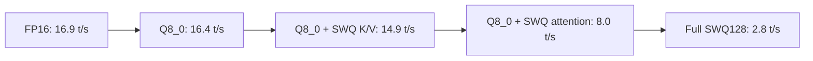
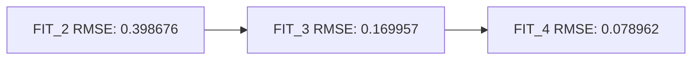
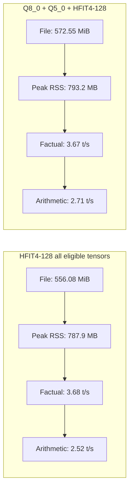

# Block-Wise Codebook and Predictive Residual Quantization for GGUF Models

## An experimental CPU implementation and empirical study in llama.cpp

**Project:** SWQ llama.cpp prototype  
**Repository:** `adsazad/swq-llama.cpp`  
**Experiment date:** 2026-07-03  
**Status:** Experimental research prototype, not a production quantization format

## Abstract

This work investigates whether neural-network weights in GGUF models can be
represented using small block-local codebooks or mathematical predictors with
compact correction values. Three runtime formats were implemented in a private
llama.cpp fork: `Q_SWQ_4`, `Q_SWQ_FIT_2`, and `Q_SWQ_FIT_3`. The implementation
supports FP16/F32 conversion, GGUF loading, CPU inference, conversion and
load-time memory reporting, and per-tensor compression statistics. GPU kernels
were not implemented.

The first useful codebook layout, SWQ128, stores 128 weights using 16 FP16
representatives and 4-bit indices. Full-model SWQ128 reduced measured peak RAM
from 1,437,073,408 bytes for FP16 to 726,646,784 bytes, but generation fell from
16.9 to 2.8 tokens/sec because the CPU kernel performs scalar codebook lookups.
A mixed Q8_0 plus SWQ128 K/V model retained 14.9 tokens/sec and saved 54.02 MiB
of peak RAM relative to Q8_0. This is the best currently usable configuration.

The predictive formats represent each 128-weight block with a cubic equation
and a residual codebook. FIT_2 reached 73.81% measured tensor-byte savings but
produced incoherent text. FIT_3 reduced mean tensor relative RMSE from 0.334946
to 0.177571, retained mean cosine similarity of 0.984012, saved 66.46% of
measured tensor bytes, and restored coherent short generation. Longer chat
tests nevertheless exposed incorrect reasoning, and generation remained only
1.1 to 2.7 tokens/sec. Increasing conversion epochs from 72 to 144 did not
improve reconstruction. The dominant limitations are residual capacity and the
unoptimized scalar inference kernel, not insufficient training epochs.

The results support a narrower conclusion than the original hypothesis. A
single equation cannot replace arbitrary model weights exactly at high
compression. A local predictor plus compact lossy corrections can provide a
useful compression tradeoff, but exact corrections largely remove the savings.
The prototype is promising as a compression experiment, but perplexity and
task-level evaluation are still required before claiming usable model quality.

## 1. Research question

The central question was:

> Can many nearby neural-network weights share a compact representation, such
> as a codebook or mathematical equation, while reducing both model storage and
> runtime memory without making inference slower or destroying model quality?

The work tested two related hypotheses:

1. **Block codebook hypothesis:** nearby weights can share representative
   values, so only a small codebook and per-weight indices need to be stored.
2. **Predictive equation hypothesis:** a block-local equation can predict much
   of each weight, leaving only compact residual corrections to store.

The desired properties were:

- conversion from FP16 or F32 GGUF;
- loader support in llama.cpp;
- CPU inference support;
- lower model file size and peak RAM;
- generation above 10 tokens/sec on the test system;
- coherent output with reconstruction accuracy sufficient for inference;
- no changes to existing Q4, Q5, or Q8 formats.

## 2. Experimental environment

| Item | Configuration |
|---|---|
| Model | Qwen2.5-0.5B-Instruct GGUF |
| Source precision | FP16 |
| Platform | macOS arm64 |
| Backend | CPU only |
| Standard inference threads | 4 |
| Primary smoke prompt | `The capital of India is` |
| Smoke generation | 16 tokens, temperature 0 |
| Main build revisions recorded | `b9860-fdb1db877`, later `b9861-552ed5eed` |
| RAM measurement | `/usr/bin/time -l`, maximum resident set size |

Results from different experimental stages should not be interpreted as a
single controlled benchmark unless the same table explicitly compares them.
Some build revisions and CLI behavior changed during development. File size,
RAM, prompt speed, generation speed, reconstruction error, and qualitative text
were recorded separately.

## 3. SWQ format designs

### 3.1 Q_SWQ_4: shared codebook quantization

For a block of weights `w_i`, SWQ learns a codebook `C` and stores an index
`k_i` for each weight:

```text
reconstructed_weight_i = C[k_i]
```

The codebook is initialized across the block minimum and maximum. Four Lloyd
clustering iterations update assignments and representative values.

The initial prototype used 32-weight blocks:

```text
16 FP16 codebook values = 32 bytes
32 packed 4-bit indices = 16 bytes
total                    = 48 bytes per 32 weights
bits per weight          = 12 bpw
```

The improved SWQ128 layout amortizes the codebook over 128 weights:

```text
16 FP16 codebook values  = 32 bytes
128 packed 4-bit indices = 64 bytes
total                     = 96 bytes per 128 weights
bits per weight           = 6 bpw
```

The larger block materially improves compression, but a weight lookup still
requires unpacking an index and selecting a codebook value during the dot
product.

### 3.2 Q_SWQ_FIT_2: cubic predictor plus 2-bit residuals

For normalized position `x_i` inside a 128-weight block, the predictor is:

```text
p_i = a0 + a1*x_i + a2*x_i^2 + a3*x_i^3
```

The reconstructed weight is:

```text
reconstructed_weight_i = p_i + R[k_i]
```

where `R` contains four FP16 residual representatives and `k_i` is a 2-bit
index.

```text
4 FP16 cubic coefficients =  8 bytes
4 FP16 residual values     =  8 bytes
128 packed 2-bit indices   = 32 bytes
total                       = 48 bytes per 128 weights
bits per weight             = 3 bpw
```

### 3.3 Q_SWQ_FIT_3: cubic predictor plus 3-bit residuals

FIT_3 retains the same cubic predictor but doubles the residual codebook from
four to eight representatives:

```text
4 FP16 cubic coefficients =  8 bytes
8 FP16 residual values     = 16 bytes
128 packed 3-bit indices   = 48 bytes
total                       = 72 bytes per 128 weights
bits per weight             = 4.5 bpw
```

This spends 1.5 additional bits per weight to reduce the quantization error
that made FIT_2 unusable.

### 3.4 Exact predictive coding experiment

Exact reconstruction requires retaining all information omitted by the
predictor:

```text
original = prediction + exact_residual
```

The offline lossless experiment represented this at the FP16 bit level:

```text
original_FP16_bits = predicted_FP16_bits XOR exact_residual_bits
```

The exact residual stream was then compressed with zlib. This guarantees exact
recovery, but it does not guarantee meaningful compression.

## 4. Conversion method

The codebook format uses min/max initialization followed by Lloyd clustering.
The FIT formats alternate these operations:

```text
1. Fit the cubic predictor.
2. Compute residuals between source weights and predictions.
3. Assign residual indices.
4. Update residual codebook values.
5. Refit the cubic against residual-corrected weights.
6. Repeat for the configured number of epochs.
```

Conversion controls:

```text
--swq-fit-epochs N
--swq-fit-residual-epochs N
--swq-fit-progress
--swq-stats
```

The progress mode prints per-tensor epoch RMSE and relative RMSE. FIT progress
conversion runs single-threaded so the output remains readable.

## 5. Implementation in llama.cpp

The implementation is marked experimental and CPU-only.

| Area | Main location | Responsibility |
|---|---|---|
| Block layouts | `ggml/src/ggml-common.h` | SWQ structures and packing layout |
| Quantization | `ggml/src/ggml-quants.c` | clustering, fitting, packing, dequantization |
| CPU dot products | `ggml/src/ggml-cpu/quants.c` | scalar SWQ x Q8_0 kernels |
| GGML type registration | `ggml/src/ggml.c` | type traits and block sizes |
| Conversion | `src/llama-quant.cpp` | tensor selection and SWQ statistics |
| Loading | `src/llama-model-loader.cpp` | SWQ recognition and load-time reporting |
| CLI type selection | `tools/quantize/quantize.cpp` | conversion flags and quantization types |
| Accuracy analysis | `tools/swq-accuracy.py` | tensor and layer error metrics |
| Layer graphs | `tools/swq-layer-report.py` | original-versus-reconstructed HTML report |
| Lossless analysis | `tools/swq-lossless-analyze.py` | exact residual compression experiment |
| FIT sweep | `tools/swq-fit-sweep.py` | offline FIT_2/FIT_3/FIT_4 comparison |

No existing Q4, Q5, or Q8 binary layouts were modified. GPU support remains
unimplemented.

## 6. Memory reporting

The `--swq-stats` option reports compression during conversion and immediately
after model loading. It includes:

- estimated original tensor bytes;
- stored SWQ tensor bytes;
- saved bytes;
- compression ratio;
- percentage saved;
- per-tensor source type and size breakdown.

This provides storage estimates before inference. Peak RSS is still measured
separately because process memory also includes mappings, metadata, runtime
buffers, allocator overhead, and the compute graph.

## 7. Experiments and results

### 7.1 Initial 32-weight Q_SWQ_4 prototype

The first complete FP16-to-SWQ conversion took 22.30 seconds. One output tensor
fell back to Q8_0 under the existing output-tensor policy.

| Measurement | FP16 | Initial SWQ | Change |
|---|---:|---:|---:|
| Converter tensor bytes | 1,260,477,952 | 885,871,104 | 374,606,848 fewer |
| GGUF file bytes | 1,266,425,696 | 891,818,848 | 374,606,848 fewer |
| GGUF file size | 1,207.76 MiB | 850.50 MiB | 357.26 MiB fewer |
| Whole-file compression | - | 1.420x | 29.58% saved |
| Converter BPW | 16.00 | 11.25 | 29.69% lower |

The first smoke test loaded successfully and generated:

```text
The capital of India is New Delhi.
```

The tokenizer, loader, CPU inference path, and output generation all worked.

### 7.2 Initial RAM and speed comparison

| Measurement | FP16 | Initial SWQ | Change |
|---|---:|---:|---:|
| Peak RSS | 1,453,572,096 bytes | 1,063,698,432 bytes | 389,873,664 fewer |
| Peak RSS | 1,386.23 MiB | 1,014.42 MiB | 371.81 MiB fewer |
| RAM reduction | - | 26.82% | 1.367x ratio |
| Prompt speed | 41.7 t/s | 37.1 t/s | 11.03% slower |
| Generation speed | 12.4 t/s | 3.0 t/s | 75.81% slower |
| Wall time | 4.35 s | 8.37 s | 92.41% longer |

Compression reduced RAM, but the scalar lookup overhead dominated generation.

### 7.3 Q8_0 activation dot-product follow-up

A fused scalar `Q_SWQ_4 x Q8_0` dot product replaced the F32 activation path.

| Measurement | FP16 | SWQ with Q8_0 activations |
|---|---:|---:|
| Peak RSS | 1,437,073,408 bytes | 1,097,121,792 bytes |
| RAM saved | - | 324.20 MiB, 23.66% |
| Prompt speed | 95.2 t/s | 74.2 t/s |
| Generation speed | 16.9 t/s | 3.9 t/s |

Generation improved from 3.0 to 3.9 tokens/sec but remained about 77% slower
than FP16. A bucketed scalar dot-product variant was also tested later and
reduced SWQ128 generation from 2.8 to 2.5 tokens/sec, so it was not retained.

### 7.4 SWQ128 full-model result

| Model | File bytes | Peak RSS | Prompt speed | Generation speed |
|---|---:|---:|---:|---:|
| FP16 | 1,266,425,696 | 1,437,073,408 | 95.2 t/s | 16.9 t/s |
| Full SWQ128 | 521,347,936 | 726,646,784 | 55.1 t/s | 2.8 t/s |

Full SWQ128 converter summary:

- quantized size: 491.52 MiB;
- whole-model effective rate: 6.54 BPW;
- SWQ tensor bytes: 515,400,192;
- measured tensor compression ratio: 2.45x;
- measured tensor bytes saved: 59.11%.

The block-size change substantially improved compression, but generation speed
remained below the 10 tokens/sec target.

### 7.5 Selective SWQ128 over a Q8_0 base

| Model | File bytes | Peak RSS | Prompt speed | Generation speed |
|---|---:|---:|---:|---:|
| Q8_0 | 675,710,816 | 1,265,451,008 | 265.1 t/s | 16.4 t/s |
| Q8_0 + SWQ128 K/V | 673,990,496 | 1,208,811,520 | 119.0 t/s | 14.9 t/s |
| Q8_0 + SWQ128 all attention | 661,948,256 | 1,184,022,528 | 98.0 t/s | 8.0 t/s |

The K/V-only model saved 56,639,488 bytes, or 54.02 MiB, of peak RSS relative
to Q8_0 while remaining above the speed target. Applying SWQ to all attention
tensors saved more memory but dropped generation below the target.



### 7.6 Full Q_SWQ_FIT_2

| Measurement | Result |
|---|---:|
| File bytes | 336,112,480 |
| Peak RSS | 545,701,888 |
| Quantized size | 314.87 MiB |
| SWQ tensor bytes | 330,164,736 |
| Tensor compression ratio | 3.82x |
| Tensor bytes saved | 73.81% |
| Prompt speed | 62.4 t/s |
| Generation speed | 1.2 t/s |
| Output quality | Incoherent |

Example output:

```text
. I. I.
.
The and

2
```

Layer relative RMSE was roughly 0.35 across most transformer blocks, with the
worst tensors above 0.42. The 2-bit residual codebook was too small to preserve
full-model behavior.

### 7.7 FIT_2 conversion-epoch study

Increasing conversion epochs does not alter model size. It only spends more
conversion time searching for coefficients and residual assignments.

| FIT_2 run | Conversion time | Mean rel RMSE | Worst rel RMSE | Mean cosine | Output |
|---|---:|---:|---:|---:|---|
| Initial | 5.47 s | 0.365959 | 0.424710 | 0.930333 | Incoherent |
| 6x2 | 22.52 s | 0.336538 | 0.391867 | 0.941415 | Incoherent |
| 24x4 | 110.90 s | 0.334946 | 0.389966 | 0.941987 | Incoherent |
| 72x4 | 484.64 s | 0.334946 | 0.389966 | 0.941987 | Incoherent |
| 144x4 | 862.09 s | 0.334946 | 0.389966 | 0.941987 | Not rerun; same accuracy |


The practical convergence point was reached by 24x4. The 72x4 and 144x4 runs
confirmed that the residual bit budget, not the optimizer duration, limited
accuracy.

### 7.8 Exact lossless predictor experiment

| Tensor selection | Original bytes | Best exact bytes | Ratio | Saved |
|---|---:|---:|---:|---:|
| Attention K/V weights | 11,010,048 | 10,521,011 | 1.046x | 4.44% |
| Transformer weights | 715,739,136 | 676,472,697 | 1.058x | 5.49% |

The best configuration was usually delta prediction with block size 512.
Exact residuals preserved every FP16 bit but also preserved most of the source
entropy. The resulting 4.44% to 5.49% savings are too small to justify a new
runtime format and on-the-fly decompressor.

### 7.9 Offline residual-width sweep

The offline sweep compared the same cubic predictor with 2-bit, 3-bit, and
4-bit residual indices over transformer weights.

| Format | Original bytes | Estimated bytes | Ratio | Saved | Relative RMSE |
|---|---:|---:|---:|---:|---:|
| FIT_2 | 715,739,136 | 134,201,088 | 5.333x | 81.25% | 0.398676 |
| FIT_3 | 715,739,136 | 201,301,632 | 3.556x | 71.88% | 0.169957 |
| FIT_4 | 715,739,136 | 290,769,024 | 2.462x | 59.38% | 0.078962 |




FIT_3 offered the most relevant tradeoff for a target near 70% savings. FIT_4
was numerically safer but reduced estimated savings to about 59%.

### 7.10 Runtime Q_SWQ_FIT_3

| Model | File size | Quant size | SWQ tensor bytes | Ratio | Saved | Conversion time |
|---|---:|---:|---:|---:|---:|---:|
| FIT_3 72x4 | 409 MB | 403.20 MiB | 422,782,464 | 2.98x | 66.46% | 388.79 s |

| Runtime format | Mean rel RMSE | Worst rel RMSE | Mean cosine |
|---|---:|---:|---:|
| FIT_2 72x4 | 0.334946 | 0.389966 | 0.941987 |
| FIT_3 72x4 | 0.177571 | 0.219497 | 0.984012 |

The FIT_3 smoke prompt generated:

```text
The capital of India is Delhi.
```

Prompt speed was 62.9 tokens/sec and generation speed was 2.7 tokens/sec. The
short output was coherent, unlike full FIT_2.

### 7.11 FIT_3 epoch convergence

| Run | Conversion time | Mean rel RMSE | Worst rel RMSE | Mean cosine |
|---|---:|---:|---:|---:|
| FIT_3 72x4 | 388.79 s | 0.177571 | 0.219497 | 0.984012 |
| FIT_3 144x4 | 1494.58 s | 0.177571 | 0.219497 | 0.984012 |

Doubling fit epochs increased conversion time by about 3.84x without changing
the reported reconstruction metrics. FIT_3 had converged by 72x4 on this model.

### 7.12 Longer deterministic chat evaluation

Longer tests used the 72x4 FIT_3 model, four threads, temperature 0, seed 1,
conversation mode, and a 64-token limit. Processes were run sequentially. An
earlier capture attempt accidentally left multiple CLI processes alive; those
outputs were discarded before the corrected one-process measurements.

| Prompt | FIT_3 behavior | FIT_3 generation speed | Q8_0 control |
|---|---|---:|---|
| Explain blue sky and red sunset | Coherent and correctly mentioned atmospheric scattering, but omitted the red-sunset mechanism | 2.4 t/s | Incomplete and scientifically weak, 59.0 t/s |
| Apple arithmetic | Treated 8 apples sold as the number remaining; correct final answer is 26 | 1.2 t/s | Not run in corrected sequence |
| Exactly three backup steps | Produced three coherent numbered steps and followed the requested format | 1.1 t/s | Not run in corrected sequence |

The chat test changes the interpretation of the successful smoke prompt. FIT_3
can preserve grammar and simple instruction following, but one correct factual
completion does not establish reasoning accuracy. The arithmetic failure is a
clear counterexample.

### 7.13 Configurable HFIT4 layer-mixed follow-up

A later follow-up used the existing `--tensor-type-file` mechanism to test a
category-aware mixed model without adding another GGML storage type. The
configuration kept token embeddings and the output tensor in Q8_0, assigned
Q5_0 to attention Q/K/V/output weights, and assigned `Q_SWQ_HFIT_4_128` to FFN
gate/up/down weights in every transformer layer.

```text
\.attn_(q|k|v|output)\.weight=q5_0
\.ffn_(gate|up|down)\.weight=q_swq_hfit_4_128
```

Q5_0 was selected for the attention portion because its 32-weight block divides
the tested Qwen row widths. This avoids the row-layout incompatibility found in
the 256-weight hierarchical experiment.

| Metric | HFIT4-128 on all eligible tensors | Q8_0 + Q5_0 + HFIT4-128 |
|---|---:|---:|
| File size | 556.08 MiB | 572.55 MiB |
| Peak RSS | 787,857,408 bytes | 793,247,744 bytes |
| Factual generation | 3.68 t/s | 3.67 t/s |
| Arithmetic generation | 2.52 t/s | 2.71 t/s |



Both models answered the short factual prompt with New Delhi. Full HFIT4 gave a
direct completion, while the mixed model reformatted the answer as an
unrequested multiple-choice question. Both arithmetic outputs were structured
and coherent within the token limit. In longer generation, full HFIT4 became
repetitive and the mixed model produced unrelated multiple-choice text.

The 96-token timing pair was interrupted before completion. A replacement run
encountered a large host slowdown, from several tokens/sec to 0.46 tokens/sec,
so it was excluded from the speed comparison. The valid paired measurements
show a 7.5% arithmetic-speed improvement for the mixed profile, but effectively
no factual-speed improvement. The mixed model was also 16.47 MiB larger and
used about 5.4 MB more peak RSS. This category-only assignment therefore did
not improve the overall HFIT4 tradeoff.

## 8. Interactive graphs and layer reports

The repository contains detailed HTML reports with downsampled original and
reconstructed weight curves. Metrics are computed over the selected full
tensors even though plots are downsampled for browser performance.

### Main visual reports

- [`models/swq/swq-fit-comparison-report.html`](../../models/swq/swq-fit-comparison-report.html): original FP16 values overlaid with FIT_2, FIT_3, and FIT_4 estimates.
- [`models/swq/swq-fit-3-epochs72-layer-report.html`](../../models/swq/swq-fit-3-epochs72-layer-report.html): runtime FIT_3 72x4 layer report.
- [`models/swq/swq-fit-3-epochs144-layer-report.html`](../../models/swq/swq-fit-3-epochs144-layer-report.html): runtime FIT_3 144x4 layer report.
- [`models/swq/swq-fit-2-epochs24-layer-report.html`](../../models/swq/swq-fit-2-epochs24-layer-report.html): FIT_2 24x4 layer report.
- [`models/swq/swq-fit-2-epochs72-layer-report.html`](../../models/swq/swq-fit-2-epochs72-layer-report.html): FIT_2 72x4 convergence report.
- [`models/swq/swq-fit-2-epochs144-layer-report.html`](../../models/swq/swq-fit-2-epochs144-layer-report.html): FIT_2 144x4 convergence report.
- [`models/swq/swq-fit-sweep-blocks.html`](../../models/swq/swq-fit-sweep-blocks.html): FIT residual-width sweep graphs.
- [`models/swq/swq-lossless-analysis-blocks.html`](../../models/swq/swq-lossless-analysis-blocks.html): exact transformer predictor compression report.
- [`models/swq/swq-lossless-analysis-kv.html`](../../models/swq/swq-lossless-analysis-kv.html): exact K/V predictor compression report.

### Machine-readable graph data

- `models/swq/swq-fit-comparison-report.csv`
- `models/swq/swq-fit-sweep-blocks.csv`
- `models/swq/swq-lossless-analysis-blocks.csv`
- `models/swq/swq-lossless-analysis-kv.csv`
- `models/swq/accuracy-swq-fit-2-epochs24.csv`
- `models/swq/accuracy-swq-fit-2-epochs72.csv`
- `models/swq/accuracy-swq-fit-2-epochs144.csv`
- `models/swq/accuracy-swq-fit-3-epochs72.csv`
- `models/swq/accuracy-swq-fit-3-epochs144.csv`

## 9. Main findings

### Finding 1: block-local sharing compresses real model weights

SWQ128 demonstrates substantial file and RAM reduction. The concept is
technically valid and works end to end in GGUF conversion, loading, and CPU
inference.

### Finding 2: compressed storage does not automatically produce faster inference

The scalar kernels must unpack indices, reconstruct predictions, select
codebook entries, and perform arithmetic for every block. On this CPU, the
extra operations cost much more than the reduced memory traffic saves. Full
SWQ128 and FIT_3 are therefore slower despite being smaller.

### Finding 3: residual capacity matters more than additional epochs

FIT_2 plateaued by 24x4 and FIT_3 plateaued by 72x4. Training longer did not
change the representational limit of a fixed residual codebook. Moving from
2-bit to 3-bit residuals produced the major accuracy improvement.

### Finding 4: exact reconstruction conflicts with the compression target

Model plus exact residuals guarantees perfect recovery but saved only 4.44% to
5.49% in the tested streams. Arbitrary FP16 residuals contain too much entropy
to disappear into a small equation.

### Finding 5: FIT_3 is the best research result, not the best usable result

FIT_3 achieves 66.46% measured tensor-byte savings and much better numerical
similarity than FIT_2. It also restores coherent short output. However, its
1.1 to 2.7 tokens/sec generation and arithmetic failure prevent it from being
called usable.

### Finding 6: selective SWQ is currently the practical approach

Q8_0 plus SWQ128 on attention K/V tensors is the only tested SWQ configuration
that exceeds 10 generation tokens/sec while reducing measured peak RAM. It
saves only 54.02 MiB relative to Q8_0, but it is the current practical result.

### Finding 7: tensor-category mixing is not enough

The configurable Q8_0/Q5_0/HFIT4 profile demonstrates that different tensor
types and block sizes can coexist in one GGUF model. However, replacing all
attention weights with Q5_0 did not reduce RAM or improve factual generation
relative to full HFIT4, and qualitative stability became worse. A useful mixed
profile needs layer- or tensor-sensitivity measurements, not only names such as
attention and FFN.

## 10. Threats to validity

This study has important limitations:

- only one small Qwen model was evaluated;
- only one macOS arm64 CPU system was measured;
- GPU support was absent;
- scalar experimental kernels are not representative of optimized performance;
- most quality evidence is reconstruction error plus a few prompts;
- perplexity, KL divergence, and a standard task benchmark were not measured;
- prompt speed varied between builds and should only be compared within a
  controlled table;
- a 64-token cap truncated some otherwise continuing answers;
- reconstruction RMSE does not directly predict language-model accuracy;
- mixed formats were not exhaustively searched layer by layer.
- the HFIT4 mixed follow-up used a small prompt set, and its long timing run was
  invalidated by interruption and host slowdown.

These constraints prevent a claim that SWQ is better than established llama.cpp
quantization formats.

## 11. Recommended next experiments

The next work should prioritize evidence and runtime efficiency rather than
more FIT epochs.

1. Measure perplexity for FP16, Q8_0, Q4_K_M, SWQ128, FIT_3, and selected hybrid
   models on the same fixed corpus.
2. Run a small deterministic evaluation set covering factual recall,
   arithmetic, instruction following, and long continuation.
3. Implement an ARM NEON `Q_SWQ_FIT_3 x Q8_0` dot-product kernel with efficient
   3-bit unpacking and coefficient reuse.
4. Profile cycles spent in index unpacking, residual lookup, polynomial
   reconstruction, and memory access before redesigning the block layout.
5. Test a layer-adaptive hybrid: preserve sensitive tensors in Q8_0 or FIT_4 and
   use FIT_3 only where layer reconstruction and perplexity remain acceptable.
6. Compare actual process RSS, not only tensor-byte estimates, for every hybrid.
7. Repeat the best configuration on at least one larger model before drawing a
   general conclusion.

## 12. Reproduction commands

### Build

```sh
cmake -B build -DGGML_METAL=OFF
cmake --build build --config Release -j
```

### Convert to SWQ128

```sh
./build/bin/llama-quantize --swq-stats \
    models/swq/qwen2.5-0.5b-instruct-fp16.gguf \
    models/swq/qwen2.5-0.5b-instruct-q-swq-4-128.gguf \
    Q_SWQ_4
```

### Convert to FIT_3

```sh
./build/bin/llama-quantize --swq-stats \
    --swq-fit-epochs 72 \
    --swq-fit-residual-epochs 4 \
    --swq-fit-progress \
    models/swq/qwen2.5-0.5b-instruct-fp16.gguf \
    models/swq/qwen2.5-0.5b-instruct-q-swq-fit-3-epochs72.gguf \
    Q_SWQ_FIT_3
```

### Convert the current usable hybrid

```sh
./build/bin/llama-quantize --swq-stats \
    --tensor-type attn_k=q_swq_4 \
    --tensor-type attn_v=q_swq_4 \
    models/swq/qwen2.5-0.5b-instruct-fp16.gguf \
    models/swq/qwen2.5-0.5b-instruct-q8-swq-kv-128.gguf \
    Q8_0
```

### Run deterministic inference

```sh
./build/bin/llama-cli \
    -m models/swq/qwen2.5-0.5b-instruct-q-swq-fit-3-epochs72.gguf \
    -p "The capital of India is" \
    -n 16 \
    -t 4 \
    --temp 0 \
    --swq-stats \
    --single-turn
```

### Generate a layer report

```sh
python3 tools/swq-layer-report.py \
    models/swq/qwen2.5-0.5b-instruct-fp16.gguf \
    models/swq/qwen2.5-0.5b-instruct-q-swq-fit-3-epochs72.gguf \
    --out models/swq/swq-fit-3-epochs72-layer-report.html
```

## 13. Conclusion

### Hierarchical 256-weight follow-up

After the main study, an offline hierarchical extension grouped two local
128-weight cubic predictors under one shared residual codebook. INT8
coefficients were trained jointly with the residual assignments. At 12x2, the
no-anchor design reached 0.134605 relative RMSE. Storing the two largest-error
FP16 values per 256 weights reduced relative RMSE to 0.130659 at an estimated
rate below 4 bpw. A self-contained per-block-scale version reached 0.133266 at
exactly 4.0 bpw with two anchors.

This improvement could not be directly transferred to a standard GGML
256-weight block for the Qwen test model. Of 170 matrix tensors, 146 have row
widths not divisible by 256, primarily width 896. Since GGML blocks cannot
cross rows, most tensors would fall back to another type. The result remains a
useful representation experiment, but a general runtime version requires a
128-compatible hierarchy or a row-aware storage extension.

The project established that experimental SWQ tensor types can be integrated
end to end into GGUF and llama.cpp without modifying existing Q4, Q5, or Q8
formats. Codebook sharing and predictive residual coding both reduce storage
and measured RAM. The strongest compression-quality result is FIT_3: 66.46%
measured tensor-byte savings, mean relative RMSE of 0.177571, and coherent short
generation. The strongest usable runtime result is the Q8_0 plus SWQ128 K/V
hybrid: 14.9 tokens/sec and 54.02 MiB lower peak RSS than Q8_0.

The original ambition of reconstructing many weights from one small equation
is limited by residual entropy. Exact residuals preserve quality but save very
little, while small lossy residuals save much more but change model behavior.
FIT_3 shows that the tradeoff can be improved, but it does not yet solve it.

The project is therefore onto a real compression mechanism, but not yet a
competitive general-purpose quantization format. The next decisive evidence is
perplexity and task evaluation, and the next decisive engineering step is a
vectorized ARM CPU kernel.

The configurable HFIT4 follow-up also shows that format mixing itself is not a
solution. The Q8_0/Q5_0/HFIT4 model was slightly faster on one arithmetic
prompt, but it was larger, used more peak RAM, and was less stable on factual
and longer text. Full HFIT4-128 remained the better result in that comparison.
Future hybrid work should assign formats from measured tensor sensitivity and
task-level quality, then optimize the HFIT4 reconstruction kernel.

## Appendix A. Primary recorded artifacts

The full raw inventory is maintained in `docs/development/SWQ-FINDINGS.md`.
Primary artifacts include:

- conversion logs under `models/swq/conversion*.log`;
- inference logs under `models/swq/smoke*.log`;
- accuracy summaries under `models/swq/accuracy*.txt`;
- tensor metrics under `models/swq/accuracy*.csv`;
- interactive layer reports under `models/swq/*layer-report.html`;
- lossless predictor data under `models/swq/swq-lossless-analysis-*`;
- residual-width sweep data under `models/swq/swq-fit-sweep-*`;
- original-versus-predicted graphs under
  `models/swq/swq-fit-comparison-report.html`.

## Appendix B. Metric definitions

For original values `y_i`, reconstructed values `y_hat_i`, and `N` values:

```text
RMSE = sqrt(sum((y_i - y_hat_i)^2) / N)

relative_RMSE = RMSE / sqrt(sum(y_i^2) / N)

cosine_similarity =
    sum(y_i * y_hat_i) /
    (sqrt(sum(y_i^2)) * sqrt(sum(y_hat_i^2)))

compression_ratio = original_bytes / compressed_bytes

percentage_saved =
    100 * (original_bytes - compressed_bytes) / original_bytes
```

Lower RMSE is better. Cosine similarity closer to 1 is better. Neither metric
alone proves that generated language quality is preserved.
